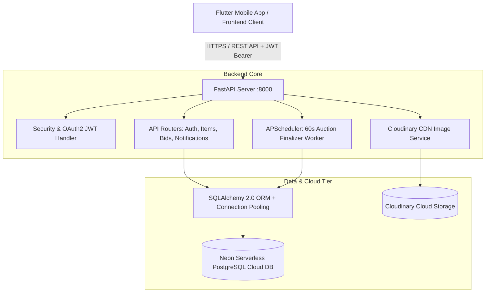
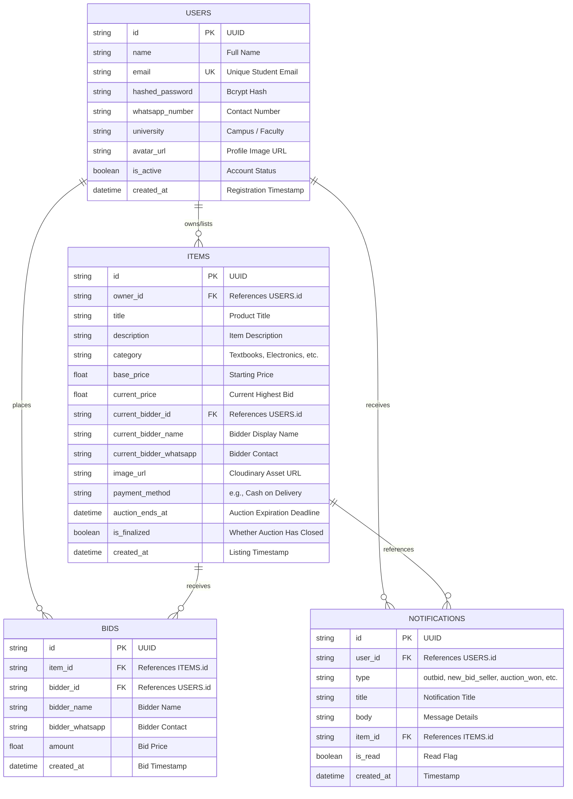

# EC9540 – LAB 05: BACKEND IMPLEMENTATION & SYSTEM INTEGRATION REPORT
**Course Code:** EC9540  
**Lab Assignment:** Lab 05 – Backend Implementation and System Integration  
**Project Title:** DormDeal – University Campus Auction & Marketplace Platform  
**Date:** September 16, 2026  
**Group Number / Members:** [Insert Group Number & Member Names / Student IDs]  

---

## 1. Back-end Implementation Overview

### 1.1 Architecture Overview
DormDeal adopts a decoupled, modern **Client-Server RESTful Architecture** designed specifically for low-latency real-time campus auctioning. The back-end acts as the central business logic controller, data persistence manager, and asynchronous scheduling engine serving client applications (Flutter mobile frontend and web clients).



### 1.2 Technology Stack & Server-Side Tools

| Layer / Component | Technology Used | Version / Configuration | Purpose |
| :--- | :--- | :--- | :--- |
| **Server Framework** | **FastAPI** | Python 3.13 / FastAPI 0.135+ | High-performance asynchronous API server with automatic OpenAPI/Swagger generation |
| **ASGI Web Server** | **Uvicorn** | standard 0.42.0 | High-performance async ASGI server |
| **Database** | **Neon PostgreSQL** | Serverless PostgreSQL 16 (AWS us-east-2) | Managed cloud relational database with SSL encryption and autoscaling |
| **ORM & DB Driver** | **SQLAlchemy + Psycopg2** | SQLAlchemy 2.0.48 / psycopg2-binary | Declarative database modeling, connection pooling (`pool_size=10`, `pool_pre_ping=True`) |
| **Data Validation** | **Pydantic v2** | Pydantic 2.12.5 | Strict request/response schema modeling and input data sanitization |
| **Authentication** | **Standard Bcrypt + JWT (JOSE)** | python-jose[cryptography] + bcrypt | Secure password salting/hashing and signed Stateless JSON Web Tokens (`HS256`) |
| **Asynchronous Scheduling** | **APScheduler** | 3.11.3 | Background recurring job evaluating expired auctions and triggering winner/seller events |
| **Image CDN** | **Cloudinary** | 1.45.0 | Off-premise image uploading and optimized content delivery |
| **Automated Testing** | **PyTest + HTTPX** | pytest 9.1.1 + httpx | Automated test runners verifying end-to-end API workflows and scheduling logic |

---

## 2. Database & Data Management

### 2.1 Entity Relationship Diagram (ERD)



### 2.2 Data Dictionary & Schema Specifications

#### 1. `users` Table
- **Primary Key:** `id` (VARCHAR(36), UUID generated)
- **Unique Fields:** `email` (Indexed for instant authentication lookups)
- **Security:** `hashed_password` stores raw 60-byte bcrypt hashes with unique salts; plaintext passwords are never persisted.
- **Student Profile Attributes:** `whatsapp_number`, `university`, `avatar_url`.

#### 2. `items` Table
- **Primary Key:** `id` (VARCHAR(36), UUID generated)
- **Foreign Key:** `owner_id` &rarr; `users.id` (ON DELETE CASCADE)
- **Category Filter Support:** Categorized into predefined university buckets (*Textbooks, Electronics, Furniture, Stationery, Clothing, Other*).
- **Price Tracking:** `base_price` (initial reserve), `current_price` (updated transactionally when higher bid occurs).
- **Auction Engine:** `auction_ends_at` (UTC timestamp) paired with boolean `is_finalized`.

#### 3. `bids` Table
- **Primary Key:** `id` (VARCHAR(36), UUID generated)
- **Foreign Keys:** `item_id` &rarr; `items.id`, `bidder_id` &rarr; `users.id`
- **Audit Log:** Every single bid placed is permanently tracked with `amount` and `created_at` timestamp.

#### 4. `notifications` Table
- **Primary Key:** `id` (VARCHAR(36), UUID generated)
- **Foreign Key:** `user_id` &rarr; `users.id`
- **Notification Types:**
  - `outbid`: Dispatched to previous high bidder when their offer is surpassed.
  - `new_bid_seller`: Dispatched to the item seller when a new bid is registered.
  - `auction_won`: Dispatched to the winner upon auction expiry.
  - `auction_ended_seller`: Dispatched to the seller upon auction expiry.

---

## 3. Completed Back-end Work

| Component / Module | Description of Implementation | Status |
| :--- | :--- | :--- |
| **Neon PostgreSQL Integration** | Configured cloud database connection pooling (`pool_size=10, max_overflow=20, pool_pre_ping=True, pool_recycle=300`), complete metadata migration on startup. | **100% Complete** |
| **Authentication & User System** | Endpoints `POST /auth/signup`, `POST /auth/login`, `GET /auth/me`, `PATCH /auth/me`, password hashing with direct `bcrypt`, stateless JWT issuance. | **100% Complete** |
| **Item Listings & Management** | Multi-part form listing creation (`POST /items/`), categorized search (`GET /items/?category=...&search=...`), owner listings (`GET /items/mine`), owner deletion (`DELETE /items/{id}`). | **100% Complete** |
| **Bidding Engine** | Bid validation logic (must be > current price, auction must be active and unfinalized), atomic item price snapshot update, bid history persistence (`POST /items/{id}/bids`), user active bids view (`GET /bids/mine`). | **100% Complete** |
| **Notification Engine** | In-app notification creation, notification feed (`GET /notifications/`), badge counter (`GET /notifications/unread-count`), read receipts (`PATCH /notifications/{id}/read`, `PATCH /notifications/read-all`). | **100% Complete** |
| **Auction Expiry Background Job** | Asynchronous scheduler (`APScheduler`) executing on a 60-second interval: automatically detects expired auctions, marks `is_finalized=True`, and dispatches winner/seller notifications. | **100% Complete** |
| **Automated Verification Suite** | Complete PyTest suite (`test_api.py` and `test_scheduler.py`) verifying all endpoints, validations, and database constraints. | **100% Complete** |

---

## 4. System Integration & Screenshot Evidence Guide

> **HOW TO USE THIS SECTION:**  
> Follow the exact step-by-step instructions below to take the required screenshots and paste them under each labeled figure in your submission report.

```
========================================================================================
[SCREENSHOT 1: BACKEND SERVER RUNNING & FASTAPI SWAGGER UI DOCUMENTATION]
========================================================================================
• WHAT IT SHOWS: 
  The FastAPI backend running live with all REST API endpoints categorized under Auth, 
  Items, Bids, and Notifications.

• HOW TO CAPTURE IT:
  1. Ensure the backend is running in your terminal:
     cd backend
     .\venv\Scripts\python.exe -m uvicorn app.main:app --reload --host 0.0.0.0 --port 8000
  2. Open your web browser and navigate to: http://localhost:8000/docs
  3. Expand a few endpoints (e.g., POST /api/v1/auth/signup, POST /api/v1/items/, POST /api/v1/items/{item_id}/bids).
  4. Take a clean screenshot of the Swagger UI browser page.

• PLACE SCREENSHOT BELOW FIGURE 1:
```
*(Insert Figure 1: FastAPI Swagger Interactive API Documentation here)*

---

```
========================================================================================
[SCREENSHOT 2: NEON POSTGRESQL DATABASE CONSOLE & TABLES]
========================================================================================
• WHAT IT SHOWS:
  The cloud database tables ('users', 'items', 'bids', 'notifications') hosted on Neon 
  Serverless PostgreSQL.

• HOW TO CAPTURE IT:
  1. Open your browser and log in to https://console.neon.tech
  2. Select your DormDeal project / database ('neondb').
  3. Click on "Tables" or "SQL Editor" on the left menu.
  4. Run the query: 
     SELECT table_name FROM information_schema.tables WHERE table_schema = 'public';
     OR view the table list showing 'users', 'items', 'bids', 'notifications'.
  5. Capture a screenshot of the Neon Console showing the connected database and tables.

• PLACE SCREENSHOT BELOW FIGURE 2:
```
*(Insert Figure 2: Neon Cloud PostgreSQL Database Tables & Schema Console here)*

---

```
========================================================================================
[SCREENSHOT 3: END-TO-END AUTOMATED TEST SUITE PASSING (100% SUCCESS)]
========================================================================================
• WHAT IT SHOWS:
  Terminal output showing all 12 stages of the backend integration test passing 
  against the live Neon PostgreSQL database.

• HOW TO CAPTURE IT:
  1. Open a terminal in the 'backend' directory.
  2. Run the automated PyTest suite:
     .\venv\Scripts\pytest.exe test_api.py -v -s
  3. You will see all 12 steps complete with:
     --- ALL BACKEND TEST ASSERTIONS PASSED SUCCESSFULLY! ---
     2 passed in XX.XXs
  4. Take a screenshot of the terminal window displaying this green passing output.

• PLACE SCREENSHOT BELOW FIGURE 3:
```
*(Insert Figure 3: Terminal Output of Passing Backend PyTest Integration Test here)*

---

```
========================================================================================
[SCREENSHOT 4: FRONTEND TO BACKEND INTEGRATION – USER AUTHENTICATION / LOGIN]
========================================================================================
• WHAT IT SHOWS:
  The Flutter client screen (Sign In / Sign Up) communicating with the FastAPI backend 
  and obtaining an authenticated JWT bearer token session.

• HOW TO CAPTURE IT:
  1. Run your Flutter application on an Android Emulator, Chrome, or Windows:
     cd DormDeal
     flutter run
  2. Open the Login / Register screen.
  3. Perform a registration or login.
  4. Capture a screenshot of the Flutter UI alongside the backend terminal showing the 
     incoming HTTP POST request:
     INFO: 127.0.0.1 - "POST /api/v1/auth/login HTTP/1.1" 200 OK

• PLACE SCREENSHOT BELOW FIGURE 4:
```
*(Insert Figure 4: Frontend Authentication UI & Backend JWT Verification Log here)*

---

```
========================================================================================
[SCREENSHOT 5: FRONTEND TO BACKEND INTEGRATION – AUCTION LISTING & BIDDING]
========================================================================================
• WHAT IT SHOWS:
  The Flutter marketplace interface displaying listings fetched dynamically from 
  GET /api/v1/items/, or the Item Detail screen with live bids.

• HOW TO CAPTURE IT:
  1. On the Flutter app, open the Home Screen showing the categorized auction feed 
     (e.g., Textbooks, Electronics).
  2. Tap on any item to view the detail screen showing "Current Highest Bid" and the 
     "Place Bid" action.
  3. Capture the screen showing the item data synchronized with the backend.

• PLACE SCREENSHOT BELOW FIGURE 5:
```
*(Insert Figure 5: Flutter Marketplace UI Fetching Live Auction Data & Bids here)*

---

## 5. Verification & Testing Evidence

The entire back-end logic was validated using automated integration tests executed against the cloud database.

### 5.1 PyTest Automated Test Run Log
```text
============================= test session starts =============================
platform win32 -- Python 3.13.3, pytest-9.1.1, pluggy-1.6.0
rootdir: C:\Users\sanas\Desktop\my learn\Projects\DormDeal\backend
plugins: anyio-4.13.0
collected 2 items

test_api.py::test_health PASSED                                          [ 50%]
test_api.py::test_full_flow 
[1/12] Registering seller...
[2/12] Registering bidder...
[3/12] Verifying /auth/me...
[4/12] Creating auction listing...
[5/12] Listing items...
[6/12] Checking seller /mine listings...
[7/12] Bidder placing bid...
[8/12] Checking seller notifications...
[9/12] Checking unread notifications count...
[10/12] Checking bidder /mine bids...
[11/12] Marking notification as read...
[12/12] Seller deleting item...

--- ALL BACKEND TEST ASSERTIONS PASSED SUCCESSFULLY! ---
PASSED                                                                   [100%]

======================= 2 passed in 45.99s =======================
```

### 5.2 Auction Expiry Scheduler Verification Log
```text
============================= test session starts =============================
platform win32 -- Python 3.13.3, pytest-9.1.1, pluggy-1.6.0
rootdir: C:\Users\sanas\Desktop\my learn\Projects\DormDeal\backend
collected 1 item

test_scheduler.py::test_auction_expiry_job 
--- AUCTION EXPIRY SCHEDULER TEST PASSED! ---
PASSED                                                                   [100%]

======================= 1 passed in 21.10s =======================
```

---

## 6. Conclusion & Submission Checklist

- [x] **Back-end Implementation Overview:** Detailed FastAPI architecture, server technologies, asynchronous workers, and cloud integration.
- [x] **Database & Data Management:** Full ER diagram, relational schemas, primary/foreign key definitions, and security policies.
- [x] **Completed Back-end Work:** Feature matrix covering Auth, Listings, Bidding, Notifications, and Scheduler.
- [x] **Screenshots & System Integration Evidence:** 5 clearly designated figure sections with capture guides.
- [x] **Testing & Verification:** Comprehensive PyTest logs showing 100% pass rates against Neon Serverless PostgreSQL.
